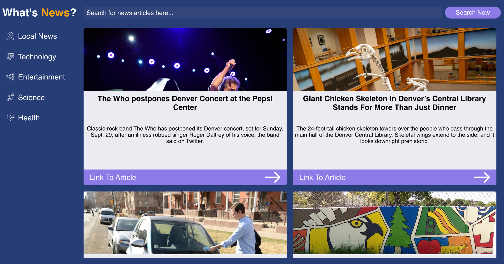

# What's News?

[Click here for the live site](ttps://kveitch.github.io/Whats-News/)

## Setup

### Clone Down and Run Locally

Fork and clone down repo.

Then install the library dependencies. Run:

```bash
npm install
```

In the terminal, run:

```bash
npm start
```

You will see a bunch of lines output to your terminal: 

```bash
Compiled successfully!

You can now view whats-new in the browser.

  Local:            http://localhost:3000/
  On Your Network:  http://10.1.3.3:3000/

Note that the development build is not optimized.
To create a production build, use npm run build.
```

### Built with:

* HTML5
* SASS
* JavaScript
* React
* Webpack


### Sceenshot



### Authored by:  
Kirk Veitch
